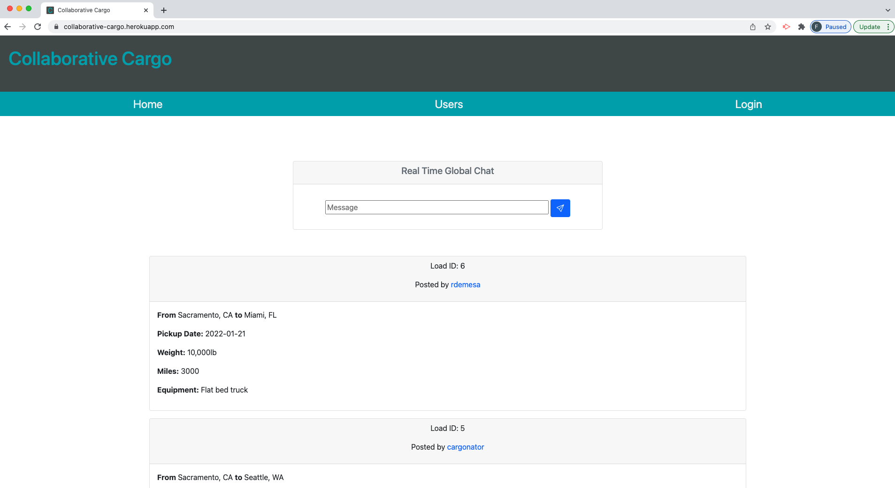

# Collaborative Cargo

## Description

This application is created to provide a matching system for users who are looking for transportation to move their items/freight/cargo with users who have the means to move them. 

## Software

This application was created using JavaScript, Node.js, Express, MySQL, Sequelize, Express-handlebars, BCrypt, Socket.io, and more with Visual Studio Code, as well as Insomnia.

## Application

The user can visit the site for the first time and they are presented with the homepage, which includes a chat feature at the top, and exisiting job or request posts beneath. On the navigation bar, there are options for Home, Users, and Login. When the user clicks on the Home option, they are taken to the homepage. When the user clicks on the Users option, they are taken to a page that lists all the users of the application. When the user clicks on Login, they are taken to a a page where they can enter their email and password to log into the site, or they have the option to select to sign up. If they click on Sign up, they are taken to a page to enter their username, email and password, and they click Signup. Once the user is logged into the site, they are taken to back to the homepage where they have a navigation bar with two more options- My Posts and Create Post. If they click on My Posts, they are taken to a page that displays all of their own posts. Under each post they have the option to select Edit Post. If they click on Edit Post, they are taken to a page where they can update their post, and save or delete the post. If they save the post, they are taken back to My Posts where the updated post will be displayed along with their other posts. If they click on delete post, they are taken back to My Posts where they will see all of their posts except the one they deleted. If the user clicks on Create Post, they are taken to a page where they can enter information for a new post such as origin, destination, pick up date, weight, miles, and equipment, and then click on Create. Once they click on Create, the user is taken back to My Posts, where their newly created post will be included along with their other posts. If the user clicks on Users in the navigation bar, while logged into the system, they are taken to list of all the users in the system. If they click on a user, they are taken to a page with a feature to message with that specific user. Once the user is done with their work on the site, they can click on the Logout option on the navigation bar, and they will be logged out of the site. When logged out, users can view all posts on the homepage, but they cannot create posts, view their own posts, or message with other users. 

## Webpage

The following image shows a screenshot of the application: . 

[Click here for a wlakthrough video](https://watch.screencastify.com/v/DKHNjWkaB0kZHIOEnat5)

You can access the GitHub repository here: https://github.com/EricKenji/collaborative-cargo.git. 

You can access the webpage here: https://collaborative-cargo.herokuapp.com/. 
